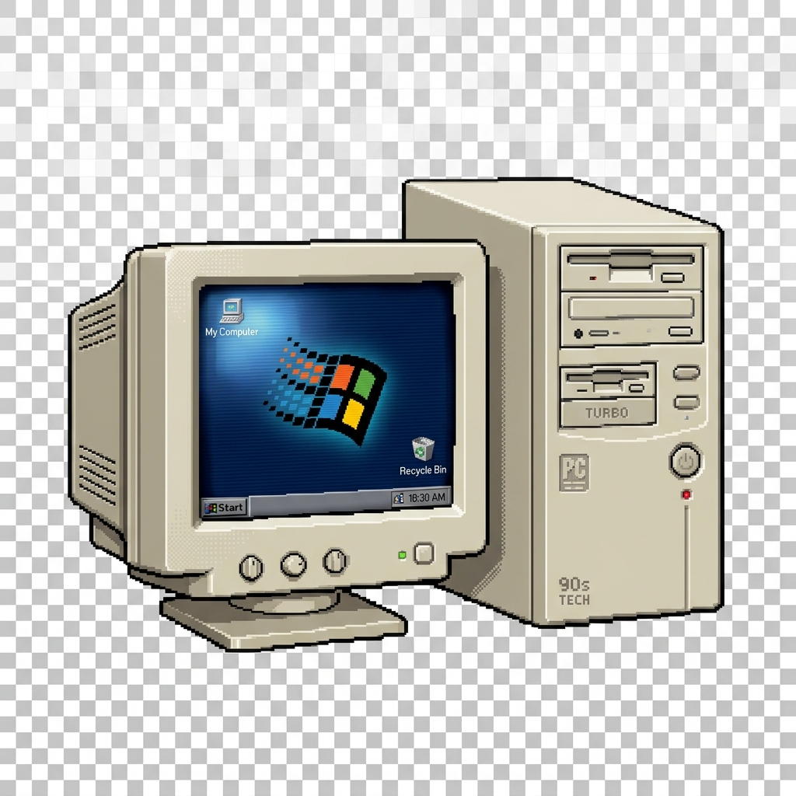
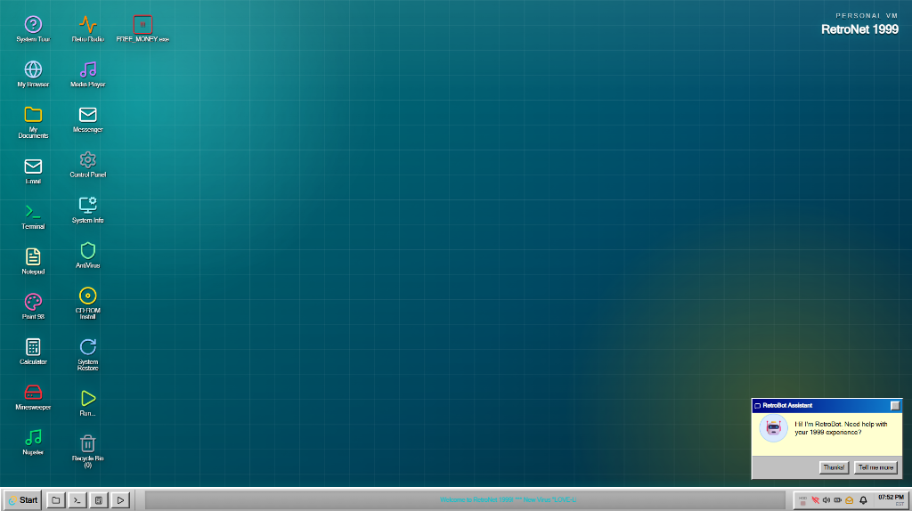

# 📟 RetroNet 1999: The Digital Time Machine

<p align="center">
  
  <br />
  <b>By Vitesh Pallapothu</b>
</p>

> **Relive the golden era of the internet.** RetroNet 1999 is a high-fidelity, interactive simulation of late-90s computing environments. Built with modern web tech, but crafted with the soul of the 20th century.

---

## 🖥️ System Overview

<p align="center">
  
  <br />
  <em>The Core Desktop Experience - Active Window Management & CRT Effects</em>
</p>

---

## 🕹️ Interactive Features

### **1. The Core OS Simulation**
*   **Active Window Manager**: Drag, resize, and minimize windows with native z-index handling.
*   **CRT Engine**: Dynamic scanlines, flickering effects, and subpixel rendering.
*   **Persistent FS**: A local-storage-backed file system that remembers your desktop layout.
*   **Soundscape**: Sample-perfect 56k dial-up sounds and vintage startup chimes.

### **2. Software Suite**
*   **🌐 RetroNet Navigator**: Surf a curated collection of legacy web archives (The Vault).
*   **🎶 WinRetro Player**: Functional MP3 playback with a real-time visualizer.
*   **🛡️ Virus Defense**: Face the chaos of the late-90s web with popup "battles" and anti-virus missions.
*   **⌨️ Terminal**: A functional MS-DOS style prompt for system commands.

### **3. Interactive Missions**
RetroNet 1999 is more than a simulator—it's a game. Complete secret objectives hidden within the system:
- [ ] **Find the Admin Password**: Hunt through emails and registry keys.
- [ ] **Modem Repair**: Manually configure your connection to enter "The Vault".
- [ ] **Worm Quarantine**: Stop the LOVE-LETTER virus from corrupting your desktop.

---

## 🛠️ System Architecture

| Component | Technology | Role |
| :--- | :--- | :--- |
| **Frontend** | React 19 + TypeScript | Core Logic & Components |
| **Styling** | Tailwind CSS v4 | Ultra-performance Retro UI |
| **Motion** | Framer Motion | 60FPS Fluid Transitions |
| **Icons** | Lucide React | Modern-Retro Iconography |
| **State** | React Context API | System-wide State Management |

---

## 👨‍💻 Developer Credits

**Created & Designed by [Vitesh Pallapothu](https://github.com/vitesh9876)**

This project was built from the ground up to provide the most authentic 90s web experience available today. Every icon, sound, and animation was curated to deliver 100% nostalgia.

---

## 📦 Getting Started

```bash
# 1. Clone the repository
git clone https://github.com/vitesh9876/RetroNet-1999

# 2. Launch the OS
cd retronet1999
npm install
npm run dev

# 3. Launch the Welcome Site
cd ../landing-page
npm install
npm run dev
```

---

<p align="center">
  <b>© 1999 RetroNet Corp. Simulation authorized for research purposes only.</b>
</p>
